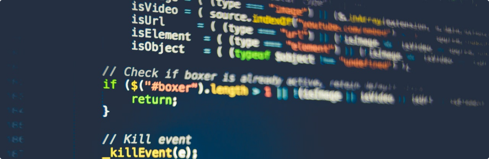

---

:wave: Hi, I am Nic from 🇿🇦. I am the maintainer of [Muffinz](https://muffinz.online)

:lips: I speak these languages and more:

   

:floppy_disk: Here is a list of tools I use:

*Photo by **[Markus Spiske](https://www.pexels.com/@markusspiske?utm_content=attributionCopyText&utm_medium=referral&utm_source=pexels)** from **[Pexels](https://www.pexels.com/photo/internet-technology-computer-display-360591/?utm_content=attributionCopyText&utm_medium=referral&utm_source=pexels)***

<!---
nic3point0/nic3point0 is a ✨ special ✨ repository because its `README.md` (this file) appears on your GitHub profile.
You can click the Preview link to take a look at your changes.
--->

